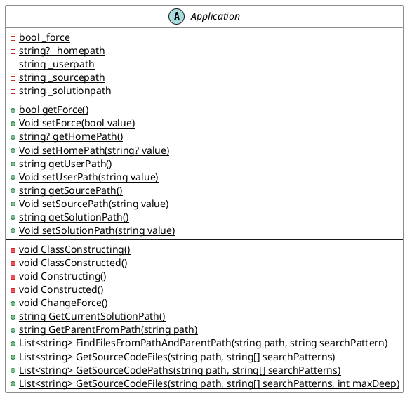

# Benutzeranleitung für die C# Klassenbibliothek

## Überblick

Diese Bibliothek bietet Basisklassen zur schnellen Erstellung von Konsolenanwendungen mit integrierten Auswahlmenüs. Sie ermöglicht es Entwicklern, effizient robuste CLI-Tools zu entwickeln, die benutzerfreundliche Menüs für die Navigation und die Ausführung verschiedener Aufgaben bieten.

## Installation

Anleitung zur Einrichtung und Installation der Bibliothek in einer Entwicklungs- oder Produktionsumgebung.

### Voraussetzungen

- .NET Core Version (net8.0)
- Visual Studio Code oder ein anderer C#-fähiger Editor

### Installationsprozess

#### Variante A - Verwendung der Quelldateien

1. Klonen/Download des [Repository](https://github.com/leoggehrer/CommonTool)
2. Öffnen der Solution-Datei (`CommonTool.sln`) in Visual Studio Code
3. Build der Lösung zur Überprüfung auf Abhängigkeiten
4. Einbinden der Klassenbibliothek in die Konsolen-Anwendung

#### Variante B - Verwendung als nuget-Package

1. Erstellen der Konsolen-Anwendung
2. Hinzufügen des nuget-Package [CommonTool.Console](https://www.nuget.org/packages/CommonTool.Console/)

## Hauptklassen und Methoden

### Application

Eine zentrale Klasse, die die Basisfunktionalitäten zur Verwaltung des Lebenszyklus einer Konsolenanwendung bereitstellt.




- **Initialisierung**
  - `Initialisierung im statischen Konstruktor`: Initialisiert wichtige Eigenschaften der Anwendung wie den 'UserPath', 'SourcePath' und den 'SolutionPath'.

### ConsoleApplication

```plantuml
Application -> ConsolenApplication

```

Diese Klasse stellt die Basis-Implementierung für die Konsolenanwendung mit einem Auswahlmenü zur Verfügung.

- **Setup**
  - Codebeispiel, das zeigt, wie man das Menü aufbaut und Nutzereingaben verarbeitet.

### TemplatePath

Enthält Hilfsmethoden zur Pfadverwaltung, die in der Konsolenanwendung verwendet werden können.

- **Überprüfen von Verzeichnissen**
  - `ContainsFiles(string path, params string[] searchPatterns)`: Überprüft, ob Dateien in einem Verzeichnis den angegebenen Mustern entsprechen.

## Beispielanwendungen

Schritt-für-Schritt-Anleitung zur Erstellung einer Konsolenanwendung mit Auswahlmenü.

- **Beispielcode**
  - Detailliertes Beispiel aus der `ConsoleApplication.cs`, das die Einrichtung und Nutzung eines Menüs zur Steuerung der Anwendung zeigt.

## Erweiterte Funktionen

Beschreibung spezieller Methoden und Erweiterungen, die für fortgeschrittene Anpassungen der Konsolenanwendungen verwendet werden können.

## FAQ und Problembehandlung

Häufig gestellte Fragen und Lösungen zu typischen Problemen, die Benutzer bei der Verwendung der Bibliothek erleben könnten.

- **Frage 1**: Wie integriere ich weitere Befehle in das Auswahlmenü?
- **Antwort**: Schrittweise Anleitung zur Integration und Verwaltung zusätzlicher Befehle.
