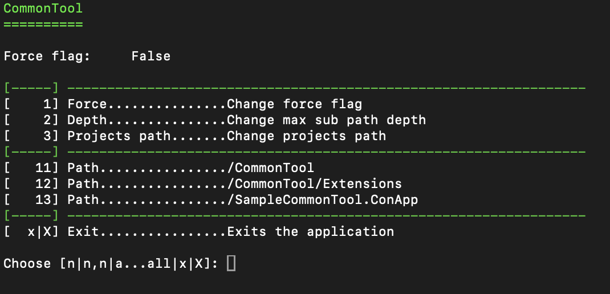

# Konsole-Anwendung mit der C# Klassenbibliothek *CommonTool*

## Überblick

Diese Konsolen-Anwendung zeigt den Einsatz von ***CommonTool*** für ein einfaches Auswahlmenü in der Konsole.

## Verwendung der Klassenbibliothek

In diesem Beispiel wird die Klassenbibliothek als nuget-Package der Konsolen-Anwendung hinzugefügt.

### Voraussetzungen

- .NET Core Version (net8.0)
- Visual Studio Code oder ein anderer C#-fähiger Editor

### Installationsprozess

#### Verwendung als nuget-Package

1. Erstellen der Konsolen-Anwendung
2. Hinzufügen des nuget-Package [CommonTool.Console](https://www.nuget.org/packages/CommonTool.Console/)
3. Die Package-Reference kann auch händich in der Projekt-Datei (*.csproj) hinzugefügt werden

```code
<Project Sdk="Microsoft.NET.Sdk">
  ...

  <ItemGroup>
    <PackageReference Include="CommonTool.Console" Version="1.0.0" />
  </ItemGroup>

</Project>
```

## Hauptklassen Erstellen

Die Erstellung der Anwendung beginnt mit der Erstellung der Hauptklasse. Im vorliegenden Beispiel wird die Klasse mit ***SampleApp*** bezeichnet und von der Klasse ***ConsoleApplication*** abgeleitet. Die Klasse ***ConsoleApplication*** ist eine abstrakte Klasse und erfordert daher die Implementierung der Methode ***protected override MenuItem[] CreateMenuItems()***. Der folgende Programmcode zeigt die Implementierung der Klasse ***SampleApp***.

```csharp
namespace SampleCommonTool.ConApp
{
    using CommonTool;
    public partial class SampleApp : ConsoleApplication
    {
        #region override methods
        /// <summary>
        /// Creates an array of menu items for the application menu.
        /// </summary>
        /// <returns>An array of MenuItem objects representing the menu items.</returns>
        protected override MenuItem[] CreateMenuItems()
        {
            var mnuIdx = 0;
            var menuItems = new List<MenuItem>
            {
                CreateMenuSeparator(),
                new()
                {
                    Key = $"{++mnuIdx}",
                    Text = ToLabelText("Force", "Change force flag"),
                    Action = (self) => ChangeForce(),
                },
                new()
                {
                    Key = $"{++mnuIdx}",
                    Text = ToLabelText("Depth", "Change max sub path depth"),
                    Action = (self) => ChangeMaxSubPathDepth(),
                },
                new()
                {
                    Key = $"{++mnuIdx}",
                    Text = ToLabelText("Projects path", "Change projects path"),
                    Action = (self) =>
                    {
                        var savePath = SourcePath;

                        SourcePath = SelectOrChangeToSubPath(SourcePath, MaxSubPathDepth, [ SourcePath ]);
                    },
                },
                CreateMenuSeparator(),
            };

            if (mnuIdx % 10 != 0)
            {
                mnuIdx += 10 - (mnuIdx % 10);
            }

            var paths = TemplatePath.GetSubPaths(SourcePath, MaxSubPathDepth + 1)
                                    .Where(p => TemplatePath.ContainsFiles(p, "*.cs"))
                                    .OrderBy(p => p)
                                    .ToArray();

            menuItems.AddRange(CreatePageMenuItems(ref mnuIdx, paths, (item, menuItem) =>
            {
                var subPath = item.Replace(SourcePath, string.Empty);

                PrintHeader();
                menuItem.Text = ToLabelText("Path", $"{subPath}");
                menuItem.Tag = "path";
                menuItem.Action = (self) => {};
                menuItem.Params = new() { { "sourcePath", item }, { "subPath", subPath } };
            }));
            return [.. menuItems.Union(CreateExitMenuItems())];
        }
        #endregion override methods
    }
}
```

Im Wesentlichen muss die Methode ***CreateMenuItems()*** implementiert werden, damit eine Instanz der Klasse ***SampleApp*** erstellt werden kann. Aufgabe der Methode ist die Erstellung einer Liste von Menü-Items, welche auf der Konsole angezeigt werden. Ein Menü-Item beinhaltet einen *Key*, einen *Kurztext* und einen *Langtext* für die Anzeige, einen *Tag* als Zusatzinformation, eine Lambda-Expression für die Menü-Aktion und Parameter über welche die Aktion versorgt werden kann.

### Starten der Anwendung

Damit das Auswahlmenü auf der Konsole angezeigt wird, müssen nur wenige Programmzeilen in die Klasse ***Program*** eingefügt werden.

```csharp
namespace SampleCommonTool.ConApp
{
    /// <summary>
    /// Represents the entry point of the application.
    /// </summary>
    public partial class Program
    {
        public static void Main(string[] args)
        {
            SampleApp app = new();

            app.Run(args);
        }
    }
}
```

### Ausgabe



Viel Spaß beim Verwenden!
